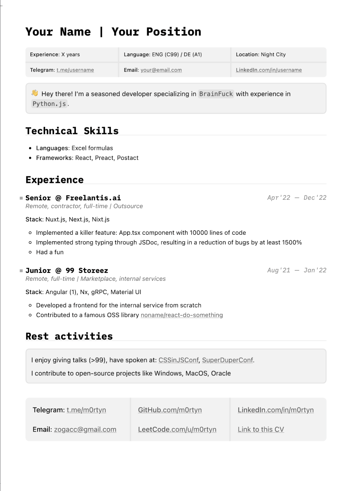

# Markdown to CV Generator

Generates clean CV from your markdown file



## Usage

```sh
> md-to-cv-generator ./EXAMPLE.md
```

## TODOs

- [x] add watch mode
- [x] add custom styles
- [ ] add converting to HTML
- [ ] add converting to jpeg
- [ ] add themes